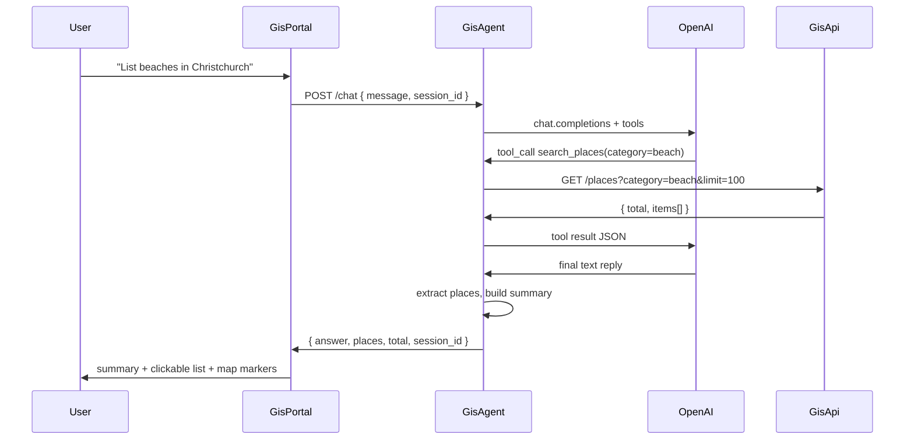

# How GisAgent Works

GisAgent is a **natural-language GIS assistant** for Christchurch place data. It sits between **GisPortal** (the Angular map UI) and **GisApi** (the REST API backed by MongoDB). Users type plain English questions; the agent calls the GIS API via OpenAI tool-calling and returns a short summary plus structured place results for the map.

---

## Role in the system

```
┌─────────────┐     POST /chat      ┌─────────────┐     GET /places…     ┌─────────────┐
│  GisPortal  │ ──────────────────► │   GisAgent  │ ───────────────────► │   GisApi    │
│  (Angular)  │ ◄────────────────── │  (FastAPI)  │ ◄─────────────────── │  (FastAPI)  │
└─────────────┘  answer + places[]  └─────────────┘      JSON places     └─────────────┘
                                           │
                                           │ chat.completions + tools
                                           ▼
                                    ┌─────────────┐
                                    │   OpenAI    │
                                    └─────────────┘
```

| Component | Responsibility |
|-----------|----------------|
| **GisPortal** | Chat UI, map pins, clickable place list |
| **GisAgent** | Session memory, LLM orchestration, tool calls to GisApi |
| **GisApi** | Authoritative place data (search, nearby, categories, POI CRUD) |
| **OpenAI** | Understands user intent and chooses which tools to call |

---

## High-level request flow

1. User submits a question in the **Intelligent search** sidebar (GisPortal).
2. Portal sends `POST /chat` with `{ message, session_id? }`.
3. Server looks up or creates a **session** → one `GisAgent` instance with conversation history.
4. `GisAgent` appends the user message and calls **OpenAI** with tool definitions.
5. If the model requests tools, the agent runs them against **GisApi** and feeds results back to the model (up to `MAX_TOOL_ROUNDS` loops).
6. When the model finishes without more tool calls, the agent:
   - Extracts places from tool results (items with `geometry`)
   - Deduplicates by `placeNameId`
   - Replaces prose with a **short summary** when places exist
7. Server returns `{ answer, places, total, session_id }`.
8. Portal shows the summary + **selectable place list** and plots pins on the map.



---

## Module layout

```
GisAgent/
├── server.py           # FastAPI app, routes, lifespan
├── agent.py            # GisAgent — OpenAI loop + tool execution
├── tools.py            # Tool schemas + dispatch to GisApiClient
├── api_client.py       # HTTP client for GisApi
├── session_store.py    # session_id → GisAgent (in-memory)
├── places.py           # Extract/dedupe places, build summary text
├── prompts.py          # System prompt for the LLM
├── schemas.py          # ChatRequest, ChatResponse, AgentResult
├── config.py           # Settings from .env (pydantic-settings)
├── dependencies.py     # FastAPI Depends(get_session_store)
├── logging_config.py   # Request logging to stdout
└── chat.py             # CLI for local testing (no HTTP)
```

---

## HTTP API

### `GET /health`

Returns agent and upstream GIS API URL:

```json
{ "status": "ok", "gisApi": "https://your-gis-api.example.com" }
```

### `POST /chat`

**Request:**

```json
{
  "message": "Show hospitals near the CBD",
  "session_id": "optional-uuid-from-previous-response"
}
```

**Response:**

```json
{
  "answer": "Found 12 places. Select one below to view on the map.",
  "places": [
    {
      "placeNameId": 123,
      "placeName": "Christchurch Hospital",
      "locality": "Christchurch Central",
      "geometry": { "type": "Point", "coordinates": [172.628, -43.534] },
      "category": "hospital",
      "ranking": { "rating": 3.8, "reviewCount": 120 }
    }
  ],
  "total": 12,
  "session_id": "a1b2c3d4-..."
}
```

- **`answer`** — Short text only (no long numbered lists when `places` is non-empty).
- **`places`** — Structured results for the map and clickable list (must include `geometry`).
- **`total`** — Full match count from GisApi when the tool returned a `total` field.
- **`session_id`** — Send on the next message to continue the conversation.

### `POST /chat/reset`

Clears conversation history for a session:

```json
{ "session_id": "a1b2c3d4-..." }
```

---

## Sessions — why they exist

HTTP is stateless. Each `GisAgent` keeps an OpenAI message list (`system` + `user` + `assistant` + `tool` messages). The **session** maps a `session_id` to one agent instance so follow-up questions work:

- "List all beaches" → then "Which ones are in Sumner?"

`SessionStore` holds this in **process memory**. Implications for Azure:

- Sessions are lost on container restart.
- Multiple replicas do not share sessions (sticky sessions or external storage would be needed for scale-out).

On shutdown, `lifespan` calls `close_all()` to release HTTP clients.

---

## The agent loop (`agent.py`)

For each user message:

1. Append `{ role: "user", content: message }` to `self.messages`.
2. Call OpenAI `chat.completions.create` with `tools=TOOL_DEFINITIONS`, `tool_choice="auto"`.
3. If the assistant returns **tool calls**:
   - Run each tool via `execute_tool()` → `GisApiClient`
   - Append tool results to `self.messages`
   - Repeat (max `MAX_TOOL_ROUNDS`, default 5)
4. If the assistant returns **no tool calls**:
   - Build `AgentResult` with extracted places and summary text

Tool errors are returned to the model as JSON `{ "error": "..." }` so it can explain what went wrong.

---

## Tools (`tools.py`)

Tools are OpenAI function definitions that mirror **GisApi** endpoints:

| Tool | GisApi endpoint | Purpose |
|------|-----------------|---------|
| `list_place_categories` | `GET /categories` | List categories |
| `search_places` | `GET /places` | Filtered search (name, category, locality) |
| `search_places_by_name` | `GET /places/by-name` | Name-focused search |
| `get_place` | `GET /places/{id}` | Single place by ID |
| `search_places_nearby` | `GET /places/nearby` | Radius search around lat/lng |
| `search_places_in_bounds` | `GET /places/in-bounds` | Bounding box search |
| `list_points_of_interest` | `GET /point-of-interest` | Demo POI list |
| `list_poi_categories` | `GET /point-of-interest/categories` | POI categories |
| `search_poi_by_name` | `GET /point-of-interest/by-name` | POI name search |
| `get_point_of_interest` | `GET /point-of-interest/{id}` | Single POI |
| `create_point_of_interest` | `POST /point-of-interest` | Create POI |
| `update_point_of_interest` | `PATCH /point-of-interest/{id}` | Update POI |
| `delete_point_of_interest` | `DELETE /point-of-interest/{id}` | Delete POI |

The system prompt instructs the model to use **`category` + `limit=100`** for "list all X" queries and **not** to enumerate places in prose (the portal renders the list).

---

## Place extraction (`places.py`)

After tool calls, the agent collects places from API JSON:

- **List responses** — `items[]` where each item has `geometry`
- **Single place** — top-level `geometry`
- **Dedupe** — by `placeNameId`
- **Summary** — e.g. `Found 84 places. Showing 20 - select one to view on the map.`

GisPortal uses `places[]` for map markers and the selectable list; it does not parse place names from `answer` text.

---

## GisPortal integration

| Portal piece | Behaviour |
|--------------|-----------|
| `AgentService.ask()` | `POST` to `environment.agentApiUrl` + `/chat` |
| `portal.ts` | Stores `session_id` from each response; sends it on the next message |
| `portal.html` | Shows `placesSummary()` + clickable list when `places.length > 0` |
| Map | `showPlacesOnMap(response.places)`; click focuses pin |

**Local dev** (`environment.ts`):

```ts
agentApiUrl: 'http://127.0.0.1:8001'
```

`proxy.conf.json` also defines `/agent` → `8001` if you prefer same-origin requests via `agentApiUrl: '/agent'`.

**Production** — set `agentApiUrl` in `environment.prod.ts` to your Azure Container Apps URL. Configure **CORS on Azure** (not in GisAgent).

---

## Configuration (`.env`)

| Variable | Required | Description |
|----------|----------|-------------|
| `OPENAI_API_KEY` | Yes | OpenAI API key |
| `OPENAI_MODEL` | No | Default `gpt-4o-mini` |
| `GIS_API_BASE_URL` | Yes | GisApi base URL (no trailing slash) |
| `MAX_TOOL_ROUNDS` | No | Default `5` |
| `LOG_LEVEL` | No | Default `INFO` |

Loaded from `GisAgent/.env` or repo root `.env`.

---

## Running locally

**Terminal 1 — GisApi** (if not using Azure):

```powershell
cd GisApi
python -m uvicorn main:app --reload --host 127.0.0.1 --port 8000
```

**Terminal 2 — GisAgent:**

```powershell
cd GisAgent
pip install -r requirements.txt
uvicorn server:app --host 127.0.0.1 --port 8001 --reload
```

**Terminal 3 — GisPortal:**

```powershell
cd GisPortal
npm start
```

**CLI only** (no HTTP):

```powershell
cd GisAgent
python chat.py
```

---

## Logging on Azure

Logs go to **stdout** (request start/end, startup/shutdown). Azure Container Apps collects container stdout automatically — use **Log stream** or **Log Analytics** in the portal. Set `LOG_LEVEL` as an environment variable on the container.

---

## Security notes

- `OPENAI_API_KEY` and GIS credentials stay server-side only.
- GisAgent does not implement CORS; configure at the Azure edge.
- Sessions are in-memory; no authentication on `/chat` in the current demo.

---

## Related docs

- [REFACTOR_REVIEW.md](./REFACTOR_REVIEW.md) — Recent structural changes and test instructions
- [GisApi/REFACTOR_REVIEW.md](../GisApi/REFACTOR_REVIEW.md) — GIS REST API details
