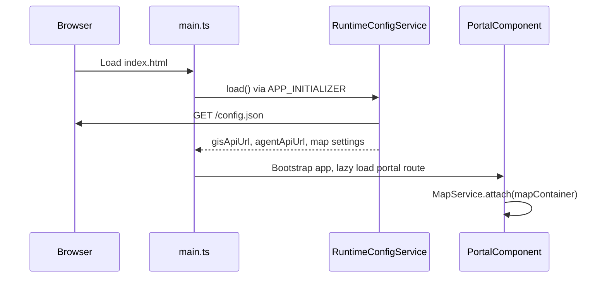
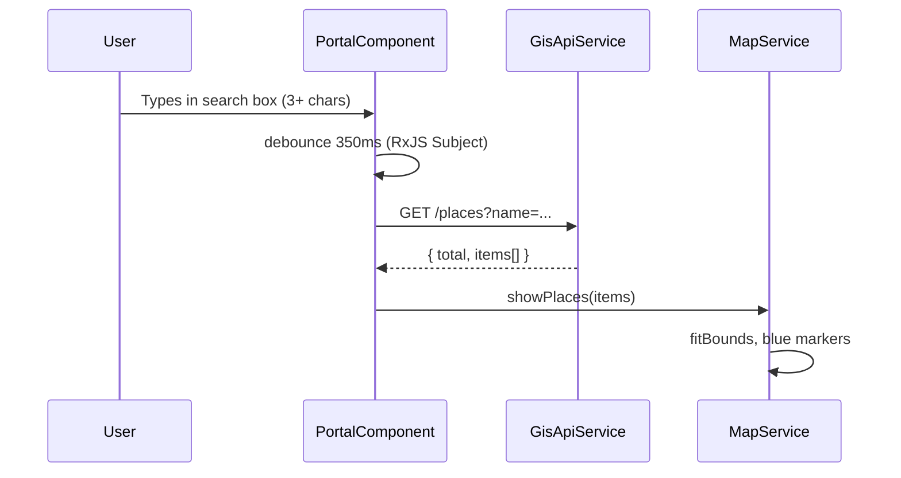
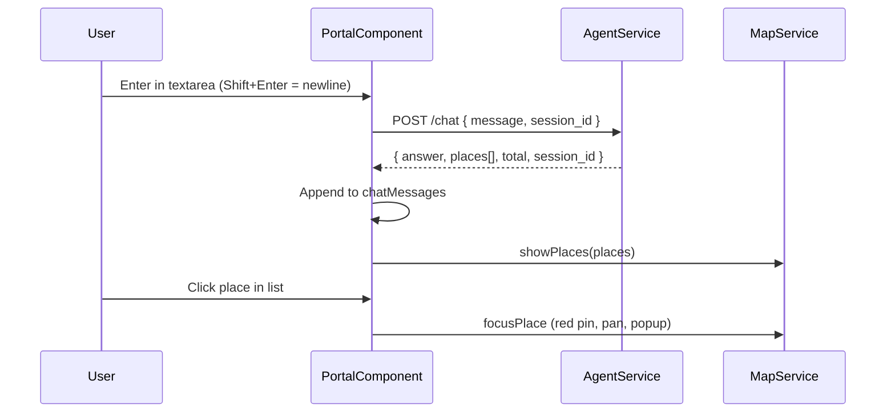

# How GisPortal Works

GisPortal is an **Angular 21** web app for exploring Christchurch place data on a **Leaflet** map. It provides two search modes: fast **name search** (direct GIS API) and **intelligent search** (natural language via GisAgent).

---

## Role in the system

```
┌─────────────────────────────────────────────────────────────────┐
│                         GisPortal (browser)                      │
│  ┌─────────────────────┐    ┌──────────────────────────────┐  │
│  │ Name search overlay │    │ Intelligent search sidebar   │  │
│  │  → GisApiService    │    │  → AgentService              │  │
│  └──────────┬──────────┘    └──────────────┬───────────────┘  │
│             │                               │                   │
│             └───────────┬───────────────────┘                   │
│                         ▼                                       │
│                  ┌─────────────┐                                │
│                  │ MapService  │  Leaflet pins, focus, bounds  │
│                  └─────────────┘                                │
└─────────────────────────────────────────────────────────────────┘
          │                              │
          ▼                              ▼
    ┌──────────┐                  ┌──────────┐
    │  GisApi  │                  │ GisAgent │
    └──────────┘                  └──────────┘
```

| Mode | API | User input | Result on map |
|------|-----|------------|---------------|
| **Name search** | GisApi `GET /places` | Type 3+ characters | All matching pins |
| **Intelligent search** | GisAgent `POST /chat` | Natural language (Enter) | Pins + selectable chat list |

---

## Project structure

```
GisPortal/
├── public/
│   └── config.json              # Runtime config (local dev defaults)
├── src/
│   ├── app/
│   │   ├── app.ts               # Root component (router outlet)
│   │   ├── app.config.ts        # Providers + config initializer
│   │   ├── app.routes.ts        # Lazy-loads PortalComponent
│   │   ├── config/
│   │   │   ├── app-config.model.ts
│   │   │   └── runtime-config.service.ts
│   │   ├── portal/
│   │   │   ├── portal.ts        # Main UI: search + chat + map host
│   │   │   ├── portal.html
│   │   │   └── portal.css
│   │   ├── services/
│   │   │   ├── gis-api.service.ts   # GIS REST client
│   │   │   ├── agent.service.ts     # GisAgent /chat client
│   │   │   └── map.service.ts         # Leaflet map lifecycle
│   │   ├── models/
│   │   │   ├── place.model.ts
│   │   │   └── chat.model.ts
│   │   └── utils/
│   │       ├── place.utils.ts         # Coordinates, summary text
│   │       └── chat-message.formatter.ts
│   ├── environments/
│   │   ├── environment.ts             # Dev build defaults
│   │   ├── environment.prod.ts
│   │   ├── gis-api-url.ts
│   │   └── agent-api-url.ts
│   ├── index.html
│   └── main.ts
├── proxy.conf.json              # Dev proxy: /api, /agent
├── Dockerfile                   # nginx + runtime config
├── docker-entrypoint.sh
├── nginx.conf
├── DEPLOY.md                    # Docker & Azure Container Apps
└── HOW_IT_WORKS.md              # This file
```

---

## Application bootstrap



1. `main.ts` bootstraps the Angular app with `appConfig`.
2. **`RuntimeConfigService.load()`** runs first — fetches `/config.json` (or falls back to build-time `environment`).
3. Router lazy-loads **`PortalComponent`** at `/`.
4. `ngAfterViewInit` attaches the Leaflet map to `#mapContainer`.

---

## Configuration

### Runtime config (`/config.json`)

All services read URLs and map settings from **`RuntimeConfigService`**:

| Field | Used by |
|-------|---------|
| `gisApiUrl` | `GisApiService` |
| `agentApiUrl` | `AgentService` |
| `mapCenter`, `defaultZoom` | `MapService` |
| `searchMinLength`, `searchDebounceMs` | `PortalComponent` name search |

**Local dev** — `public/config.json`:

```json
{
  "gisApiUrl": "/api",
  "agentApiUrl": "/agent"
}
```

**Docker / Azure** — `docker-entrypoint.sh` writes `config.json` from container env vars. See [DEPLOY.md](./DEPLOY.md).

### Dev proxy (`proxy.conf.json`)

| Browser path | Proxied to |
|--------------|------------|
| `/api/*` | GIS API (Azure or local) |
| `/agent/*` | `http://127.0.0.1:8001` (GisAgent) |

Run with **`npm start`** (includes `--proxy-config`) — not plain `ng serve`.

---

## Name search flow



- Implemented as an **RxJS pipeline** in the `PortalComponent` constructor.
- Clears markers when query drops below minimum length.
- Shows result count in the overlay status line.

---

## Intelligent search flow



### Chat UI rules

- When `places[]` is present: show **short summary** + **clickable list** only (no long LLM prose).
- Summary text from `placesSummary()` in `place.utils.ts`.
- `session_id` is stored and sent on follow-up messages for conversation context.
- **Reset** clears chat and calls `POST /chat/reset`.

### Map interaction

| Action | Behaviour |
|--------|-----------|
| AI/name search results | Blue pins, map fits bounds |
| Click place in chat list | Red selected pin, pan + tooltip + popup |
| Click pin on map | Same focus behaviour |
| Missing geometry on place | `GisApiService.getPlace(id)` fallback |

---

## Key modules

### `PortalComponent`

Orchestrates UI state only:

- Signals: `searchLoading`, `aiLoading`, `chatMessages`, `searchError`, `aiError`, `resultCount`
- Delegates all map work to `MapService`
- No Leaflet code in the template

### `MapService`

- `attach(container)` — init Leaflet + OpenStreetMap tiles
- `showPlaces(places)` — markers + `fitBounds`
- `focusPlace(place)` — red pin, `setView`, open popup
- `syncPlaces(places)` — update marker set from chat list context
- `clearMarkers()` / `destroy()`

### `GisApiService`

```typescript
GET {gisApiUrl}/places?name=...&limit=50
GET {gisApiUrl}/places/{placeNameId}
```

### `AgentService`

```typescript
POST {agentApiUrl}/chat
POST {agentApiUrl}/chat/reset
```

### `place.utils.ts`

- `getCoordinates` / `normalizePlace` — coerce GeoJSON `[lng, lat]`
- `placesSummary` — "Found N places. Select one below…"

### `chat-message.formatter.ts`

Formats markdown-style agent text (links, bold) when **no** `places[]` is returned — used for pure Q&A replies.

---

## Layout

```
┌────────────────────────────────────────────┬──────────────────┐
│                                            │ Intelligent      │
│  [ Name search overlay ]                   │ search           │
│                                            │                  │
│              MAP (Leaflet)                 │ Chat log         │
│                                            │                  │
│                                            │ [textarea]       │
└────────────────────────────────────────────┴──────────────────┘
```

- Full-height map; no top header.
- Name search floats over the map (offset for Leaflet zoom controls).
- AI panel fixed on the right.

---

## Running locally

**Prerequisites:** GisAgent on port 8001; GIS API reachable (Azure via proxy or local on 8000).

```powershell
# Terminal 1 — GisAgent
cd GisAgent
uvicorn server:app --host 127.0.0.1 --port 8001 --reload

# Terminal 2 — Portal
cd GisPortal
npm start
```

Open http://localhost:4200

---

## Production / Docker

```powershell
cd GisPortal
docker build -t gis-portal .
docker run -p 8080:8080 `
  -e GIS_API_BASE_URL=https://your-gis-api.azurecontainerapps.io `
  -e AGENT_API_BASE_URL=https://your-gis-agent.azurecontainerapps.io `
  gis-portal
```

- Container serves static files on **port 8080** (nginx).
- Configure **CORS** on GisApi and GisAgent for the portal origin.

Details: [DEPLOY.md](./DEPLOY.md)

---

## Related docs

| Doc | Contents |
|-----|----------|
| [DEPLOY.md](./DEPLOY.md) | Docker, Azure env vars, health probes |
| [REFACTOR_REVIEW.md](./REFACTOR_REVIEW.md) | Recent refactor summary |
| [../GisAgent/HOW_IT_WORKS.md](../GisAgent/HOW_IT_WORKS.md) | GisAgent architecture |
| [../GisApi/REFACTOR_REVIEW.md](../GisApi/REFACTOR_REVIEW.md) | GisApi REST endpoints |

---

## Troubleshooting

| Symptom | Likely cause |
|---------|----------------|
| Name search fails | GisApi down or wrong `gisApiUrl` in config |
| AI search fails | GisAgent not running / wrong `agentApiUrl` |
| CORS error in browser | APIs must allow portal origin (Azure config) |
| Proxy not working | Use `npm start`, not `ng serve` |
| Stale API URLs in Docker | Restart container after changing env vars |
| Click place, no map focus | Place missing geometry — check API response |
